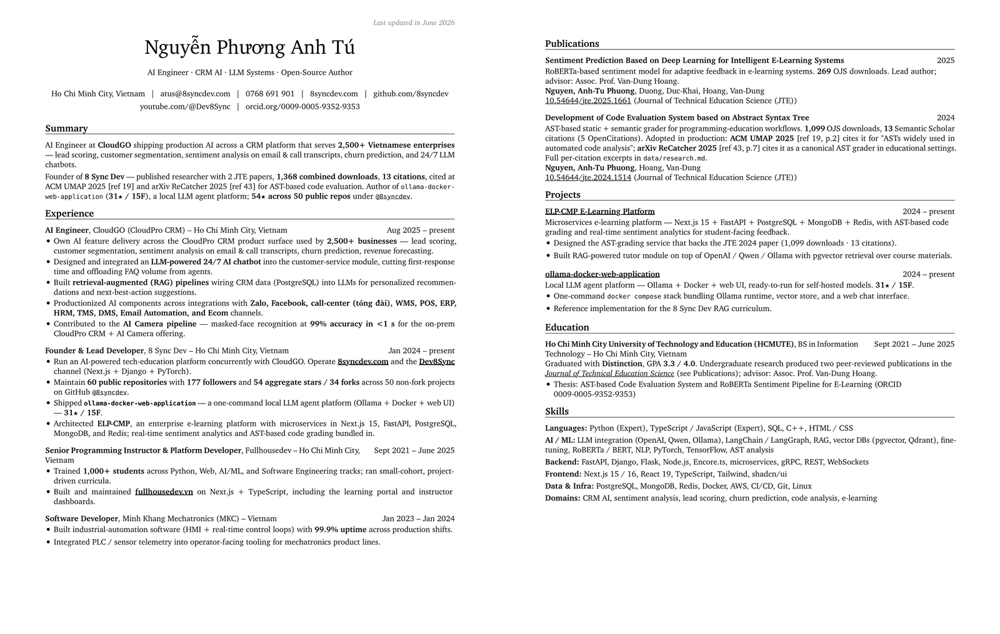

<p align="center">
  
</p>

<h1 align="center">defensible-cv</h1>

<p align="center">
  <a href="README.md">English</a> · <b>Tiếng Việt</b>
</p>

<p align="center">
  Pipeline điều khiển bằng hồ sơ: từ một file đầu vào duy nhất, xuất ra CV
  developer 2 trang chuẩn nhà tuyển dụng — nơi <b>mọi con số đều được xác minh
  trực tiếp</b> (lượt tải bài báo, trích dẫn, sao/fork GitHub) và commit làm bằng chứng.
</p>

---

## Đây là gì

Bạn điền **`profile.yaml`** (thông tin cá nhân + nguồn nghiên cứu + kinh nghiệm).
Một crawler Python xác minh số liệu qua các API công khai và ghi ra
`data/research.{json,md}`. Sau đó CV được soạn vào `cv_data.yaml`
([rendercv](https://docs.rendercv.com)) và render thành PDF 2 trang gọn gàng.

```
profile.yaml  ──►  scripts/research.py  ──►  data/research.json + research.md
                                                      │
                                                      ▼
                                  cv_data.yaml  ──►  rendercv  ──►  PDF (2 trang)
```

Bản mẫu: **[`assets/Nguyen_Phuong_Anh_Tu_CV.pdf`](assets/Nguyen_Phuong_Anh_Tu_CV.pdf)**.

## Dùng với AI agent (khuyến nghị)

Repo xây quanh một **agent skill**. Mở repo trong bất kỳ AI coding agent nào đọc
được file `AGENTS.md` / `SKILL.md` (Claude, Cursor, …). Agent sẽ đọc
[`AGENTS.md`](AGENTS.md) → [`agents/skills/defensible-cv/SKILL.md`](agents/skills/defensible-cv/SKILL.md),
và **dừng lại hỏi `profile.yaml` nếu chưa có** — không bao giờ bịa thông tin của bạn.

Sau đó chỉ cần ra lệnh bằng ngôn ngữ thường:

**Tạo CV cho người mới** (chưa có profile):

> Tôi muốn một CV developer. Thông tin của tôi — tên: …, địa điểm: …, email: …,
> GitHub: …, các bài báo (DOI): …, kinh nghiệm: …, học vấn: …, kỹ năng: ….
> Làm theo `AGENTS.md` + skill defensible-cv: viết `profile.yaml`, refresh số liệu,
> soạn `cv_data.yaml`, rồi render PDF.

**Build lại từ `profile.yaml` có sẵn:**

> Build CV: làm theo `AGENTS.md` + skill defensible-cv. Refresh số liệu từ
> `profile.yaml` rồi render PDF.

**Chỉ refresh số liệu:**

> Refresh số liệu CV và render lại PDF.

## Làm thủ công (không cần agent)

```bash
# 1. Tạo profile từ template rồi điền vào
cp profile.example.yaml profile.yaml

# 2. Xác minh số liệu (đọc research_sources trong profile.yaml; --no-scholar = an toàn cho CI)
uv run --with requests --with pyyaml --with pypdf \
  python scripts/research.py --no-scholar      # --refresh để bỏ qua cache 24h

# 3. Render CV ra PDF (không cần venv)
uv run --with "rendercv[full]>=2.8" rendercv render cv_data.yaml
```

`scripts/research.py` chỉ đọc phần `research_sources` trong `profile.yaml`. Nếu
thiếu `profile.yaml`, script dừng kèm thông báo rõ ràng thay vì bịa dữ liệu.
`profile.yaml` / `cv_data.yaml` được commit sẵn là một ví dụ hoàn chỉnh.

## Vì sao "defensible" (có thể bảo vệ trước nhà tuyển dụng)

Mọi con số trên CV đều được xác minh trực tiếp rồi commit vào `data/research.json`
để chịu được việc nhà tuyển dụng kiểm tra ngẫu nhiên:

| Nguồn | Trả về gì |
| --- | --- |
| OJS (vd jte.edu.vn) | Tổng lượt tải mỗi bài, lấy từ payload `pkpUsageStats` nhúng trong trang. |
| Semantic Scholar Graph API | Metadata bài báo + danh sách bài trích dẫn (venue, năm, tác giả, DOI). |
| OpenCitations COCI/Meta | Số trích dẫn độc lập + DOI trích dẫn (đối chiếu chéo với Semantic Scholar). |
| Crossref Event Data | Lượt nhắc trên Twitter / Wikipedia / báo chí (best-effort). |
| Google Scholar (`scholarly`) | Tùy chọn, tự bỏ qua khi gặp CAPTCHA. `--no-scholar` để skip. |
| GitHub Public API | Sao/fork mỗi repo, ngôn ngữ, tổng hợp trên các repo không phải fork. |
| **PDF bài trích dẫn** (Unpaywall → arXiv → `pypdf`) | **Tải từng bài open-access trích dẫn, tìm nhãn tham chiếu trỏ về công trình, trích nguyên văn câu + số trang nơi tác giả viện dẫn.** |

### Bằng chứng trích dẫn cụ thể

Với mỗi bài open-access có trích dẫn, `data/research.md` ghi lại nhãn tham chiếu,
trang trong danh mục tài liệu, và câu trong nội dung đã viện dẫn công trình.
Ví dụ từ lần chạy đã commit cho `10.54644/jte.2024.1514`:

> **[ACM]** *Integrating Expert Knowledge With Automated Knowledge Component
> Extraction for Student Modeling* — ACM UMAP 2025
> - Bài này tham chiếu công trình là **[19]** (trang 6 của họ).
> - tr.2 — *"…ASTs have been widely used in automated code analysis efforts **[19]**.
>   For example, Rivers used ASTs to identify each syntax structure in a student's
>   submission…"*

Bài bị tường phí (đa số IEEE, một phần ACM, MDPI sau Akamai) được giữ lại với
trạng thái `not_oa` / `fetch_failed` và đánh dấu rõ — không bịa gì.

## Cấu trúc file

```
profile.yaml                 ĐẦU VÀO: thông tin + nguồn nghiên cứu + nội dung
profile.example.yaml         template có chú thích — copy thành profile.yaml
cv_data.yaml                 nguồn rendercv (soạn từ profile + research)
scripts/research.py          CLI crawler, một file, urllib + pypdf
data/research.json           snapshot đã xác minh (tự sinh lại)
data/research.md             tóm tắt thân thiện nhà tuyển dụng (tự sinh lại)
AGENTS.md                    điểm vào cho AI agent
agents/skills/defensible-cv/SKILL.md   playbook cho agent
assets/cv-preview.png        ảnh bìa phía trên
assets/Nguyen_Phuong_Anh_Tu_CV.pdf     CV mẫu đã render
requirements.txt             dependency cố định
```

## Giấy phép

[MIT](LICENSE).
